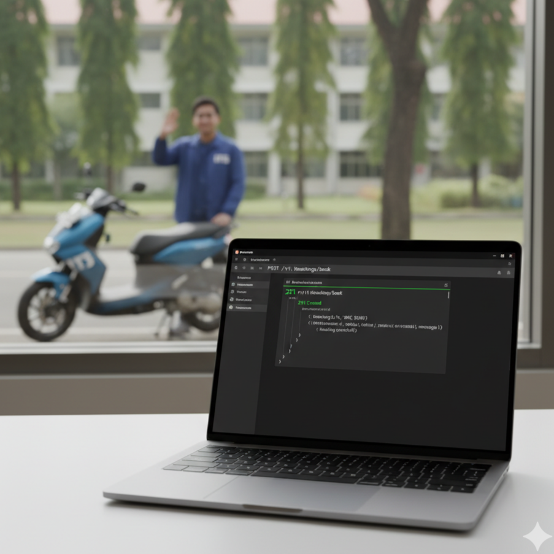

<h1>IRiT Backend</h1> 
  

<strong>Final Project No. 2:</strong> IRiT adalah sebuah sistem REST API berbasis backend service yang dirancang untuk mempermudah proses pemesanan Transportasi di ITS (pengujian dapat dilakukan menggunakan metode Postman). Sistem ini dibangun menggunakan Golang, Gin, GORM, SQLite, Postman. IRiT menyediakan layanan fitur autentikasi, booking, tracking lokasi (dummy/mock), serta riwayat booking dan order.

## @Kelompok 2 BST 
BST265 -
Muhammad Brahmana Priambudi  
BST238 -
Gabriela Asima Nainggolan  
BST087 -
Rizqi Arya Kuskhilbyano  
BST092 -
Ahmad Farras Favian Al Efasi  
BST206 -
Ahmad Zaki Fauzan Nabil  

  
Cara Menjalankan Backend IRiT

  <ul>
    <li>
      <strong>1. Prasyarat: Instalasi Go & MySQL</strong> 
      Pastikan Anda sudah menginstal software berikut:
      <ul>
        <li><a href="https://go.dev/doc/install">Go (versi 1.18 atau lebih baru)</a></li>
        <li><a href="https://git-scm.com/downloads">Git</a> untuk mengambil kode dari repository</li>
      </ul>
        
    </li>
    <li>
      <strong>2. Clone Repository dari GitHub</strong> 
      Buka terminal atau Command Prompt, navigasi folder pilihan, dan jalankan perintah berikut:
      <pre><code>git clone https://github.com/Fastering18/irit-backend.git
cd irit-backend</code></pre>
        
    </li>
    <li>
      <strong>3. Konfigurasi Koneksi Database</strong> 
      Buka file <code>configs/config.yaml</code> lalu edit <code>dsn</code> untuk lokasi penyimpanan file sqlite
      <pre><code>database: "irit.db"</code></pre>
        
    </li>
    <li>
      <strong>4. Install Dependencies</strong> 
      Unduh package Golang yang diperlukan.
      <pre><code>go mod tidy</code></pre>
        
    </li>
    <li>
      <strong>5. Jalankan Aplikasi Backend</strong> 
      Setelah semua persiapan selesai, jalankan server dengan perintah berikut:
      <pre><code>go run cmd/api/main.go</code></pre>
      Jika berhasil, Anda akan melihat output di terminal yang mirip seperti ini dan siap untuk testing.
      <pre><code>2025/10/03 10:00:00 Koneksi database berhasil.
2025/10/03 10:00:00 Migrasi database berhasil.
2025/10/03 10:00:00 Semua routes telah didaftarkan.
2025/10/03 10:00:00 Server berjalan di :8080</code></pre>
       
    </li>
  </ul>

  
Test API dengan Postman

  <ul>
    <li>
      <strong>1. Register Akun User</strong> 
      
        
    </li>
    <li>
      <strong>2. Generate Token JWT User</strong> 
      
        
    </li>
    <li>
      <strong>3. Akses User Dengan JWT</strong> 
      
        
    </li>
    <li>
      <strong>4. Register Akun Driver</strong> 
      
        
    </li>
    <li>
      <strong>5. Generate Token JWT Driver</strong> 
      
        
    </li>
    <li>
      <strong>6. Akses Driver Dengan JWT</strong> 
      
        
    </li>
    <li>
      <strong>7. Book User ke Driver</strong> 
      
        
    </li>
    <li>
      <strong>8. Driver Cek Daftar Order</strong> 
      
        
    </li>
    <li>
      <strong>9. Driver Accept Order</strong> 
      
        
    </li>
    <li>
      <strong>10. User Cek Booking History</strong> 
      
        
    </li>
    <li>
      <strong>11. Driver Set Booking Status</strong> 
      
        
    </li>
    <li>
      <strong>12. User Cek Jarak (Mock Up)</strong> 
      
        
    </li>
  </ul>

   

---

  Dibuat sebagai Final Project untuk <strong>BST Advanced 2025</strong>
   
  <small>© 2025 Kelompok 2 BST Advanced 2025. All Rights Reserved.</small>

